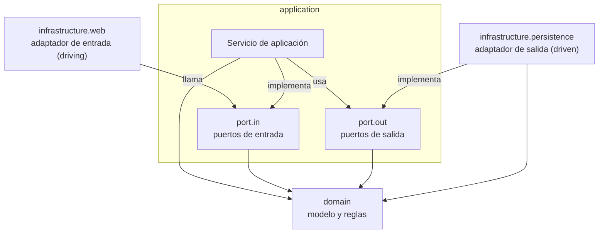

```mermaid
flowchart TB
  web["infrastructure.web<br/>adaptador de entrada (driving)"]

  subgraph application["application"]
    pin["port.in<br/>puertos de entrada"]
    svc["Servicio de aplicación"]
    pout["port.out<br/>puertos de salida"]
  end

  dom["domain<br/>modelo y reglas"]
  per["infrastructure.persistence<br/>adaptador de salida (driven)"]

  web -->|"llama"| pin
  svc -->|"implementa"| pin
  svc -->|"usa"| pout
  per -->|"implementa"| pout

  svc --> dom
  pin --> dom
  pout --> dom
  per --> dom
```